  <i>If you like what I do, please consider donating, it'd mean the world :D</i>
    
  
   
  
   
  
   
  <i>I also take <a href="https://cash.app/$kckarnige">Cash App</a> (Yes, I am that broke)</i>

----

### 👋 Heyo, I'm KiCK!

I'm a hobbyist programmer who's been making shit for the internet since 2018!

> *When in doubt, remember, "[smartfridge](https://github.com/smartfrigde) is gay, ~~ArmCord~~ [Legcord](https://github.com/Legcord/Legcord) is gayer." - My stupid ass 2024*

### Things I work well with:

### Things I'm learning:

----

## 👷‍♂️ Notable [P]rojects and [C]ontributions 🪛

### 💫 [My Website!!!!!](https://kckarnige.github.io/) [P]
The 4th rewrite of my website, built from the ground up.

### [Blox R.A.T.](https://github.com/kckarnige/BloxRAT) [P]
A simple little test API that may or may not be useful. It can either give you an avatar render of a user or give you some data about the user, like their display name and profile description.

### [e694](https://github.com/kckarnige/e694) [P]
A project not too unlike [FxEmbed](https://github.com/FxEmbed/FxEmbed) or [BetterTwitFix](https://github.com/dylanpdx/BetterTwitFix), but for the furry oriented websites e926 and e621.

### [Ecsta](https://github.com/kckarnige/EcstaTab) [P]
An open-source new tab extension that makes for good eye-candy.

### [Fresh NW](https://github.com/kckarnige/NeoNWjsForC2) [P]
This is my modernized remake of the official "NW.js for Construct 2" installer. This installs the latest version of NW.js available, for use with Construct 2. 

### [FUG IGG](https://gist.github.com/kckarnige/6dfff1025b5da69399c26957ee47b445) [P]
Because why wait to install a cryptominer, when you could do it now!!

### [Joe](https://github.com/kckarnige/SoberJoe) [P]
Lost my mind trying to figure out how to start [Sober](https://sober.vinegarhq.org/) from Firefox, so I called up Joe. 

### [Legcord](https://github.com/Legcord/Legcord) [C]
Formerly known as ArmCord. One of the first alternative Discord clients made from scratch, created by smartfridge.

### [Minecraft: Sticks n' Stones](https://mc-sns.github.io/) [P]
Just another Minecraft modpack. _(Available on [Modrinth](https://modrinth.com/modpack/mc-sns))_

### [Tools of Steel](https://github.com/kckarnige/ToolsofSteel) [P]
A Minecraft mod that rethinks Minecraft's equipment progression. _(Available on [Modrinth](https://modrinth.com/mod/tools-of-steel) and [CurseForge](https://www.curseforge.com/minecraft/mc-mods/tools-of-steel))_

 

## ✨ My Essential Software™ ✨

### 💫 [Talon](https://github.com/ravendevteam/talon)
A Windows 11 debloater that's as straight forward as using a mouse. 

### [Ecsta](https://github.com/kckarnige/EcstaTab)
Honestly, I made this 100% for myself, I just like having something nice to look at.

### [Equicord](https://github.com/Equicord/Equicord)
A fork of [Vencord](https://github.com/Vendicated/Vencord), with more plugins. *(You should still try out ~~ArmCord~~ [Legcord](https://github.com/Legcord/Legcord), it includes both Vencord and Equicord!)*

### [ExplorerPatcher](https://github.com/valinet/ExplorerPatcher)
Ever since I've "upgraded" to Windows 11, though I still enjoy the taskbar and File Explorer from Windows 10, and this is perfect!

### [Firefox](https://github.com/mozilla-firefox/firefox)
Firefox.

### [G-Helper](https://github.com/seerge/g-helper)
A simple and lightweight alternative to ASUS's Armoury Crate, it's a lot more convenient!

### [Prism Launcher](https://github.com/PrismLauncher/PrismLauncher)
The Minecraft launcher that just works™.

### [Reverse Tethering RePack](https://github.com/Kuijen/RT-RP)
I use Virtual Desktop and wondered if I could use it via USB, then I found this and I'm not going back, it's amazing!

## 🌐 My Socials 💻

TwXtter - [@kckarnige](https://x.com/kckarnige)

Discord - [@kckarnige](https://discord.com/users/634168893644210186)

Bluesky - [@kckarnige.online](https://bsky.app/profile/kckarnige.online)

Instagram - [@kckarnige](https://instagram.com/kckarnige)

YouTube - [@kckarnige](https://www.youtube.com/channel/UCHDWD1G20SVO399jCS0LDNQ)

DeviantArt - [CarnigeWasHere](https://www.deviantart.com/carnigewashere)

Roblox - [@KiCK_inTheBucket](https://www.roblox.com/users/154248006/profile)

Modrinth - [KiCKTheBucket](https://modrinth.com/user/KiCKTheBucket)

GameBanana - [KCK](https://gamebanana.com/members/1716410)

